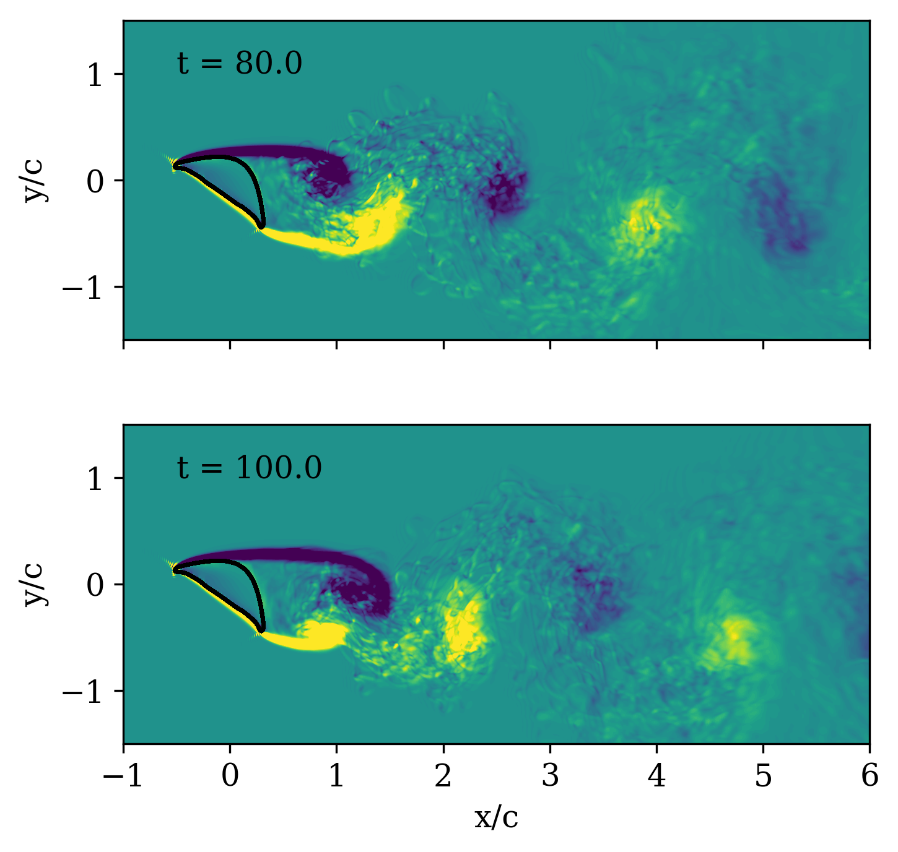

# 3D flow around a snake cylinder (Re=2000, AoA=35deg)

The present directory contains the input files to run, with Batch Shipyard, a PetIBM simulation to compute the three-dimensional flow around a gliding-snake cross-section at Reynolds number $2000$ and with a $35$-degree angle of attack.

With Batch Shipyard and Azure-CLI, we submitted a job to a pool of 2 NC24r instances with FDR InfiniBand network.
The single-task job was submitted to the pool on December 12, 2018.
The container-based PetIBM application computed $100,000$ time steps of flow simulation in 5 days and 16 hours , using 24 MPI processes and 4 GPU devices per node.

## Contents

* `config_shipyard`: YAML configuration files for Batch Shipyard.
  * `config.yaml`: global configuration.
  * `pool.yaml`: pool configuration.
  * `jobs.yaml`: jobs configuration.
* `config.yaml`: YAML configuration file for PetIBM.
* `config`: configuration files for the linear solvers in PetIBM.
* `data/snake2d.body`: initial geometry of the 2D snake cross-section.
* `snake3d35.body`: geometry of the 3D cylinder with a snake cross-section at a $35$-degree angle of attack.
* `run-petibm.sh`: Bash script to run inside the Docker container on Azure Batch.
* `scripts`: pre- and post-processing scripts.

(Note: the Batch Shipyard configuration file with the credentials, `credentials.yaml`, is not version-controlled as it contains sensitive information. You will have to generate it before creating the pool with Batch Shipyard.)

## Run

Make sure you have created a Azure Batch account and a Azure Storage account for your personal Azure subscription.
All command-lines written below are run from the `README`'s directory.
The environment variable `CLOUDREPRO` contains the path of the `cloud-repro` git folder on the local machine.

i- (optional) Create the geometry of the cylinder with a rotated snake cross-section:

```shell
python scripts/create_body.py
```

(The Python script will write the file `snake3d.body`.)

ii- (optional) Create the YAML node `mesh` to be added to the `config.yaml` PetIBM configuration file:

```shell
python scripts/create_mesh_yaml.py
```

(The Python script will write the file `mesh.yaml`, which contains the YAML node `mesh` to add/replace in `config.yaml`.)

1- Generate the YAML configuration file with your credentials:

```shell
python $CLOUDREPRO/misc/generatecredentials.py \
    --resource-group <Name of the resource group> \
    --account-name <Name of the storage account> \
    --share-name <Name of the file share> \
    --output config_shipyard/credentials.yaml
```

2- Create a `snake3d2k35` directory in the fileshare:

```shell
az storage directory create --name snake3d2k35 \
    --account-name <Name of the storage account> \
    --share-name <Name of the file share>
```

3- Create the pool, ingress input data, submit the job, and delete the pool upon completion:

```shell
export SHIPYARD_CONFIGDIR=config_shipyard
shipyard pool add
shipyard data ingress
shipyard jobs add

## wait for task completion

shipyard jobs del
shipyard pool del
```

or, alternatively, you can use the Shell script `shipyard-driver` to automatically delete the pool once the task in the job completed successfully:

```shell
export PATH=$CLOUDREPRO/misc/bin:$PATH
shipyard-driver
```

The Shell script will ask you to provide the path of the configuration directory for Batch Shipyard (which is `config_shipyard` here) and your Microsoft Azure password.
By default, it will save the Batch Shipyard logging files into the sub-folder `log_shipyard`.

4- Download the output from Azure Storage to the local machine:

```shell
mkdir output
az storage file download-batch --destination output
    --source <Name of the file share>/snake3d2k35 \
    --account-name <Name of the storage account>
```

(The size of the `output` folder downloaded from Azure Storage should be about 66 GB.)

5- Delete the `snake3d2k35` directory on Azure Storage:

```shell
export PATH=$CLOUDREPRO/misc/bin:$PATH
az-storage-directory-delete --name snake2d2k35 \
    --account-name <Name of the storage account> \
    --share-name <Name of file share>
```

## Output

The numerical solution is now located in the `output` folder.

The ASCII file `forces-0.txt` contains the forces on the snake's cross-section at each time step.
The ASCII file `iterations-0.txt` contains the number of iterations and the final residuals of the linear solvers at each time step.
The HDF5 file `grid.h5` contains the grid data.
The folder `solution` contains HDF5 files, one for each time-step saved, with the solution of the field variables (pressure, velocity components) as well as the data needed to restart a simulation.

## Post-processing steps

* History of the force coefficients

To plot the lift and drag coefficients:

```shell
python scripts/plot_force_coefficients.py
```

The Python script will save the Matplotlib figure as a PNG file, `forceCoefficients.png`, in the sub-folder `figures`.

* Vorticity

Use the PetIBM executable `petibm-vorticity` to compute the vorticity field at saved time steps.

```shell
cd output
petibm-vorticity
```

The numerical solution of the vorticity in stored in the HDF5 files located in `solution`.

* XMDF files to visualize fields with VisIt

To create the XDMF files to visualize the field variables (pressure, velocity components, and vorticity components), use the PetIBM application `petibm-createxdmf`:

```shell
cd output
petibm-createxdmf
```

The program will write the XDMF files `p.xmf`, `u.xmf`, `v.xmf`, `wx.xmf`, `wy.xmf`, and `wz.xmf` in the `output` folder.

## Re-create the figures in the manuscript

### 2D and 3D histories of the force coefficients

To re-generate the figure comparing the history of the force coefficients between the two-dimensional and three-dimensional configurations:

```shell
python scripts/plot_force_coefficients_compare_2d.py
```

(Note: it requires to have the history of the forces for the two-dimensional simulation.)
The Python script saves the Matplotlib figure as a PDF file (`forceCoefficientsCompare2D.pdf`) in the `figures` folder.

### Filled contour of the spanwise-averaged spanwise vorticity

To re-create the figure with the filled contour of the spanwise vorticity, averaged along the spanwise direction, after 80 and 100 time units of flow simulation:

```shell
python scripts/get_wz_avg.py
python scripts/plot_wz_avg_wake2d_pyplot.py
```

The Matplotlib figure is saved as a PNG file (`wz_avg_multi_contourf.png`) in the `figures` folder.



### Isosurface of the Q-criterion

To re-create the figure with the isosurface of the Q-criterion (Q=1.0) colored by the streamwise vorticity (between -5 and +5) at time unit 100:

```shell
conda activate py27-visit
python scripts/plot_qcrit_wx_wake3d_visit.py
conda deactivate
```

The figure is saved as a PNG file (`qcrit_wx_wake3d_0020.png`) in the `figures` folder.

